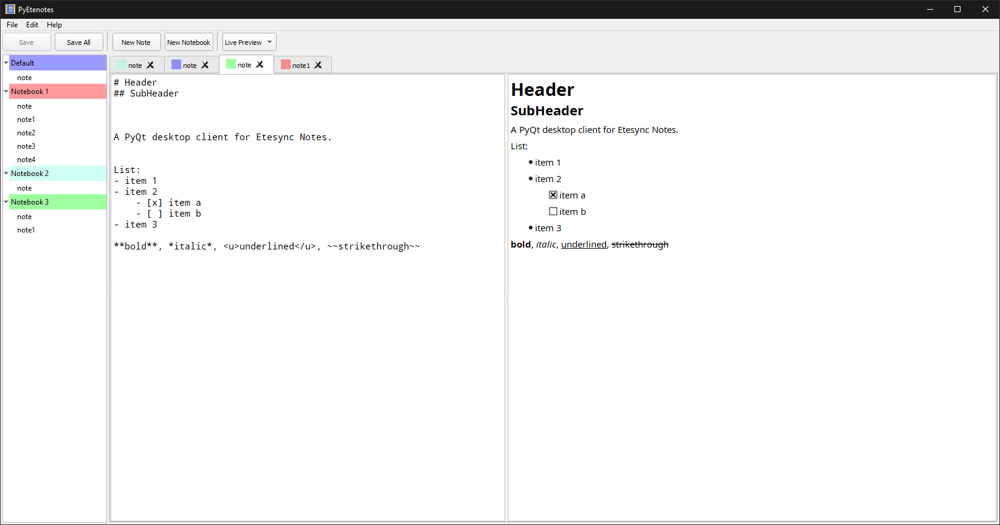
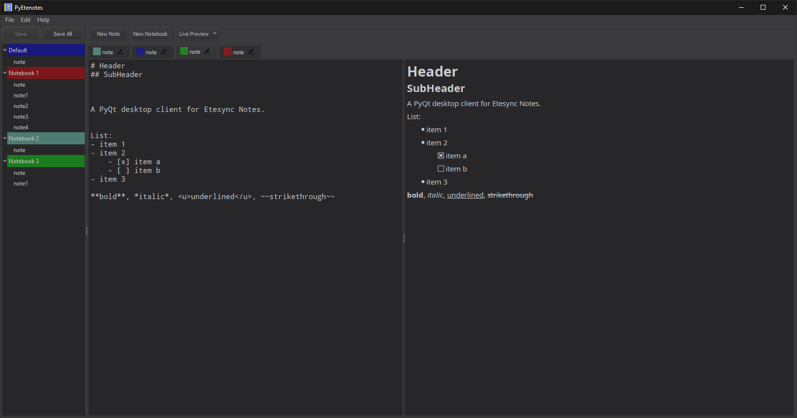

# pyetenotes

[](https://github.com/seird/pyetenotes/actions)


A PyQt desktop client for [Etesync Notes](https://github.com/etesync/etesync-notes).


Default theme                           |  Dark theme
:--------------------------------------:|:--------------------------------------:
         |  


## Download

[Download the latest release.](https://github.com/seird/pyetenotes/releases/latest)


## Install

Clone the repository and install the requirements:

```
$ cd pyetenotes
$ pip install -r requirements.txt
```

### Run from source

```
$ python entry_point.py
```

### Create a pyinstaller executable

```
$ pip install pyinstaller
$ pyinstaller pyetenotes.spec
```
An executable is created at `dist/pyetenotes/pyetenotes`.

### Create a deb package

```
$ make build

# or install

$ sudo make install
```

### Inno setup (Windows)

Create an installer for windows with inno setup:

```
$ iscc pyetenotes.iss
```


## Requirements

- Python >= 3.9
- schedule
- PyQt5
- etebase
